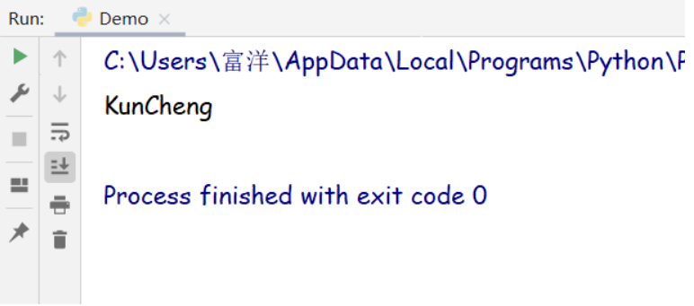

## 变量的含义

程序中，数据都是临时存储在内存中的，为了更快速的查找或使用这个数据，通常我们把这个数据在内存中存储之后定义一个名称，这个名称就是变量。

> 变量就是一个存储数据的时候当前数据所在的内存地址的名字而已

## 变量的作用

在查找数据的时候，我们找到这个变量名字就相当于找到了内存地址，找到内存也就是找到内存所存储的数据，这样就是找到了这个数据，后期我们就可以对这个数据进行各种处理。

## 定义变量

```python
变量名 = 值
```

> 变量名自定义，要满足标识符命名规则

## 标识符

标识符命名规则是Python中定义各种名字的时候的统一规范，具体如下：

- 由数字、字母、下划线组成
- 不能数字开头
- 严格区分大小写
- 不能使用内置关键字

内置关键字如下：

```python
False    None    True    and    as    	assert    break    	 class
continue def	 del	 elif   else  	except	  finally	 for  yield
from 	 global  if 	 import in 	  	is 	lambda 	 nonlocal
not 	 or 	 pass 	 raise  return	try  	  while 	 with
```

## 命名习惯

- 见名知意
- 大驼峰：即每个单词首字母都大写，例如：MyName
- 小驼峰：第二个（含）以后的单词首字母大写，例如：myName
- 下划线：例如：my_name

## 使用变量

定义一个变量并输出：

```python
myName = 'KunCheng'
print(myName)
```

控制台输出结果：



> 注意：当使用一个不存在的变量时程序会出错，你可以将第二行的myName改为其他名称，然后运行看看程序会输出什么

## 认识数据类型

在Python里为了应对不同的业务需求，也把数据分为不同的类型。


> 检测数据类型的方法：type()

代码演示：

```python
a = 1
print(type(a))  # <class 'int'> --整型
b = 1.1
print(type(b))  # <class 'float'> --浮点型
c = True
print(type(c))  # <class 'bool'> --布尔型
d = '1234'
print(type(d))  # <class 'str'> --字符串
e = [10, 20, 30]
print(type(e))  # <class 'list'> --列表
f = (10, 20, 30)
print(type(f))  # <class 'tuple'> --元组
g = {10, 20, 30}
print(type(g))  # <class 'set'> --集合
h = {'name': 'Kuncheng', 'age': 20}
print(type(h))  # <class 'dict'> --字典
```

控制台输出结果：


